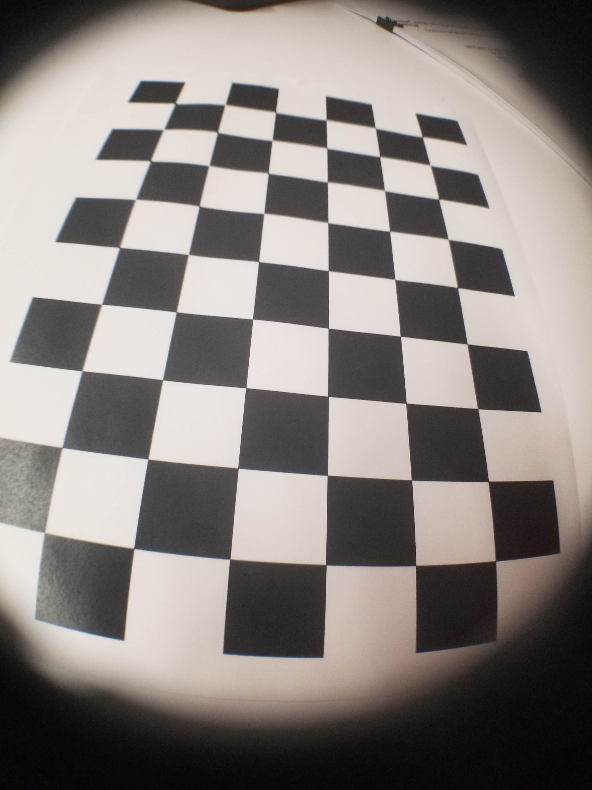
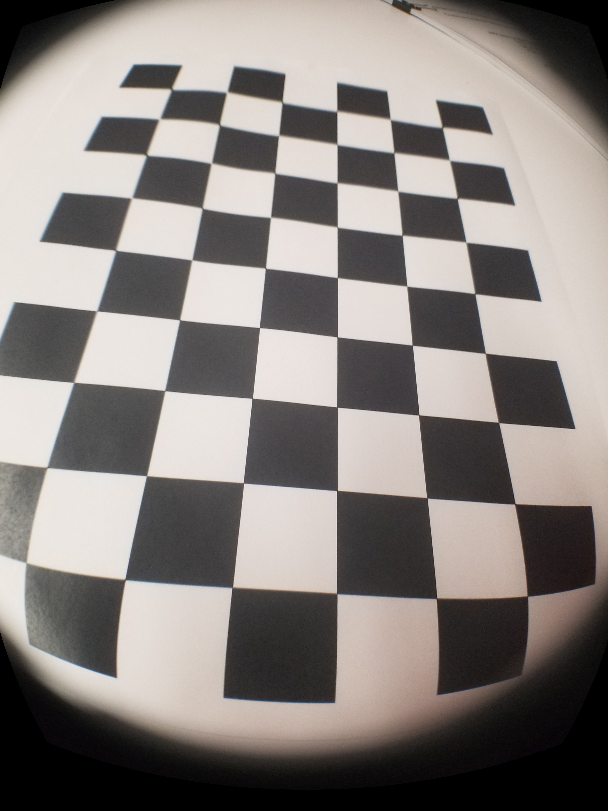

## Camera Calibration with OpenCV

The IPython notebook in this repository contains code to calculate the camera matrix and distortion coefficients using the images in the "calibration_wide" folder.

I added some test images from my Galaxy S8 with a wide-angle-lens attachment and attempted to calibrate it. See the results below.

| Input image | Un-distorted image |
| --- | --- |
| |  |
